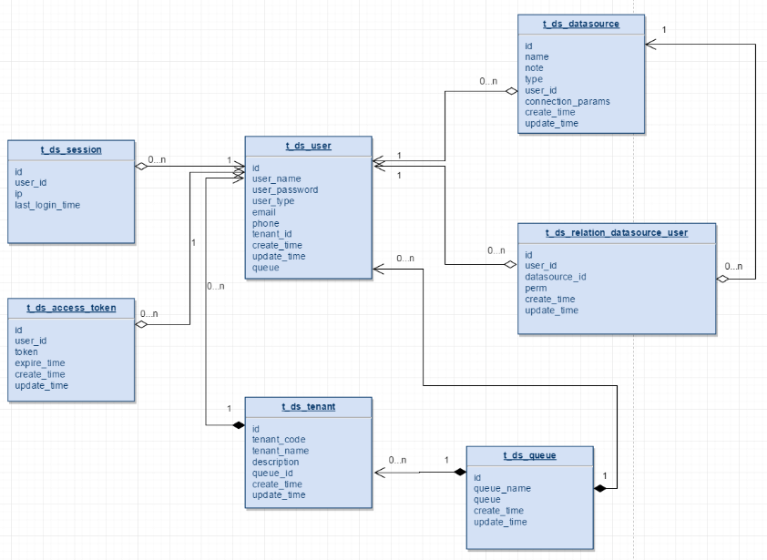
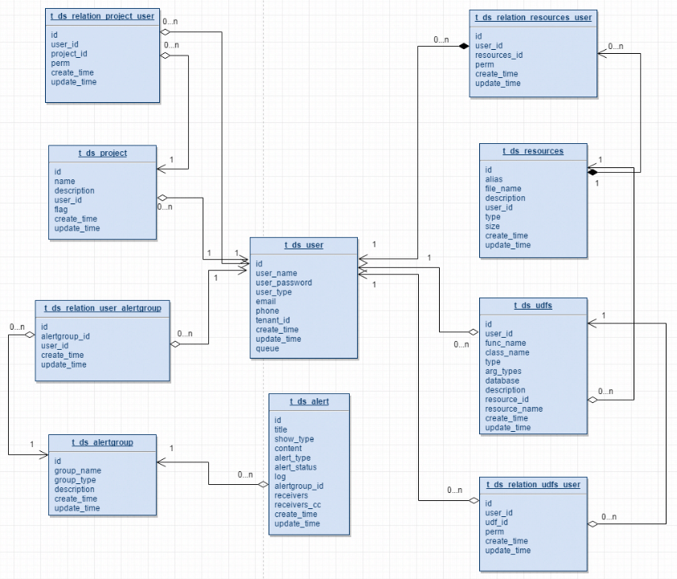
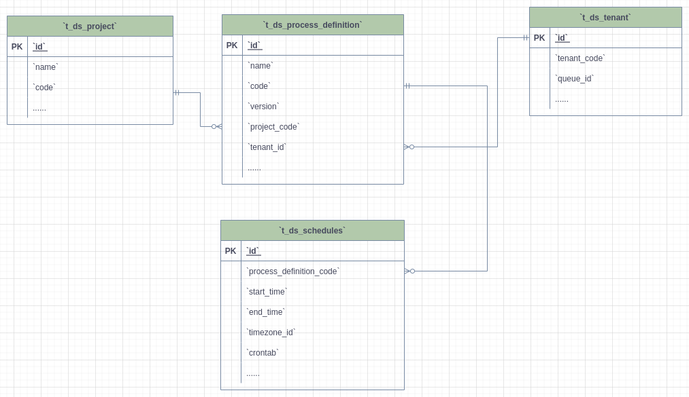
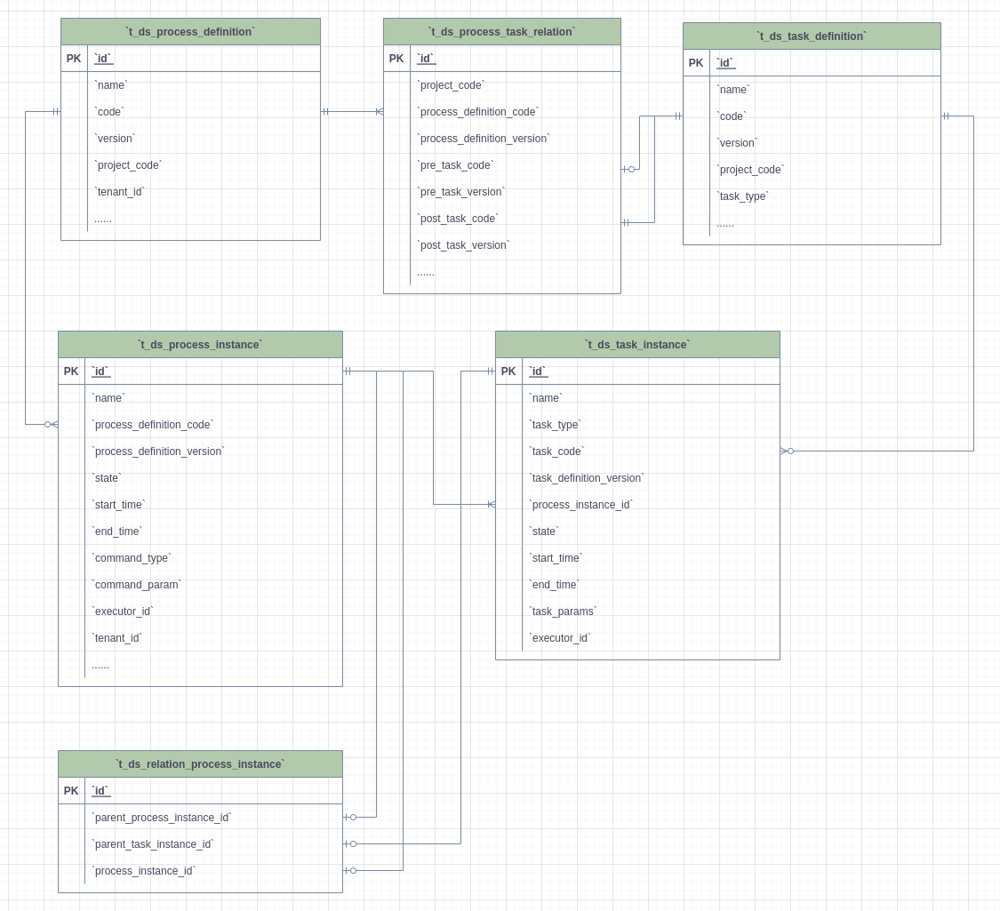
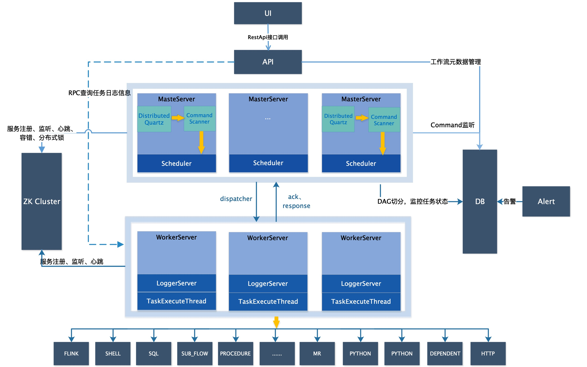
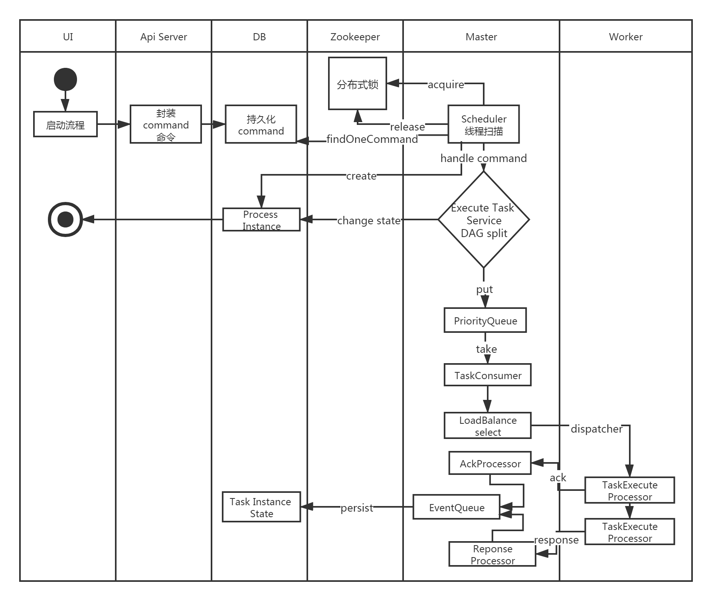
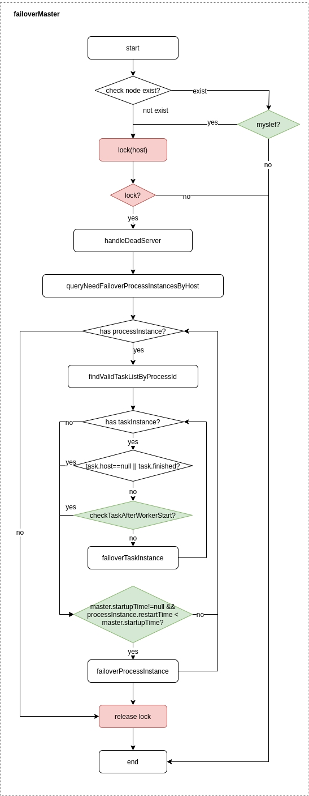
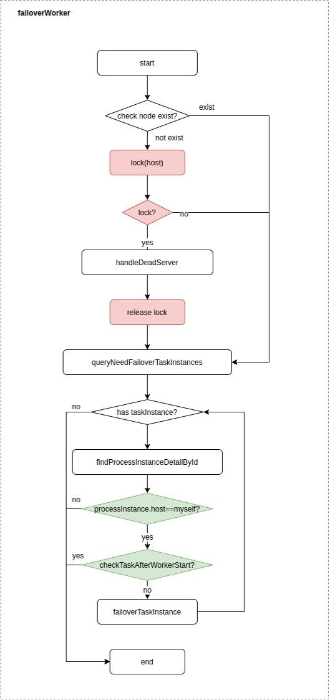
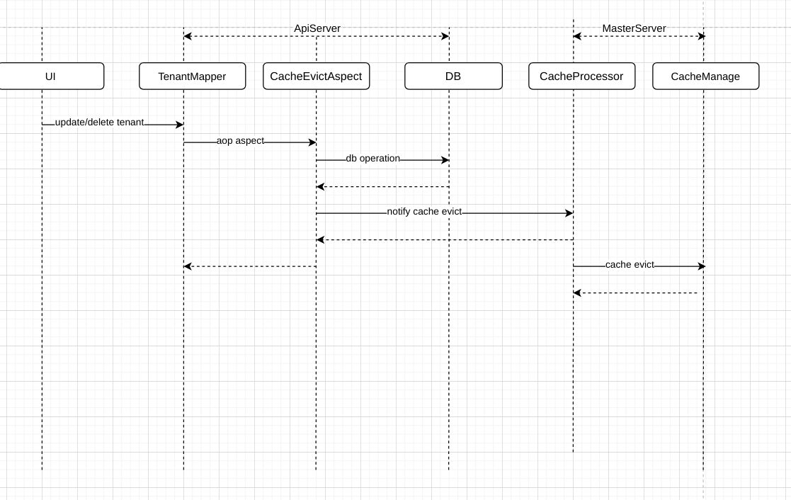

# DataWarehouse 元数据文档

## 表Schema

详见`DataWarehouse/DataWarehouse-dao/src/main/resources/sql`目录下的sql文件

## E-R图

### 用户	队列	数据源



- 一个租户下可以有多个用户；<br />
- `t_ds_user`中的queue字段存储的是队列表中的`queue_name`信息，`t_ds_tenant`下存的是`queue_id`，在流程定义执行过程中，用户队列优先级最高，用户队列为空则采用租户队列；<br />
- `t_ds_datasource`表中的`user_id`字段表示创建该数据源的用户，`t_ds_relation_datasource_user`中的`user_id`表示对数据源有权限的用户；<br />

### 项目	资源	告警



- 一个用户可以有多个项目，用户项目授权通过`t_ds_relation_project_user`表完成project_id和user_id的关系绑定；<br />
- `t_ds_projcet`表中的`user_id`表示创建该项目的用户，`t_ds_relation_project_user`表中的`user_id`表示对项目有权限的用户；<br />
- `t_ds_resources`表中的`user_id`表示创建该资源的用户，`t_ds_relation_resources_user`中的`user_id`表示对资源有权限的用户；<br />
- `t_ds_udfs`表中的`user_id`表示创建该UDF的用户，`t_ds_relation_udfs_user`表中的`user_id`表示对UDF有权限的用户；<br />

### 项目 - 租户 - 工作流定义 - 定时



- 一个项目可以有多个工作流定义，每个工作流定义只属于一个项目；<br />
- 一个租户可以被多个工作流定义使用，每个工作流定义必须且只能选择一个租户；<br />
- 一个工作流定义可以有一个或多个定时的配置；<br />

### 工作流定义和执行



- 一个工作流定义对应多个任务定义，通过`t_ds_process_task_relation`进行关联，关联的key是`code + version`，当任务的前置节点为空时，对应的`pre_task_node`和`pre_task_version`为0；
- 一个工作流定义可以有多个工作流实例`t_ds_process_instance`，一个工作流实例对应一个或多个任务实例`t_ds_task_instance`；
- `t_ds_relation_process_instance`表存放的数据用于处理流程定义中含有子流程的情况，`parent_process_instance_id`表示含有子流程的主流程实例id，`process_instance_id`表示子流程实例的id，`parent_task_instance_id`表示子流程节点的任务实例id，流程实例表和任务实例表分别对应`t_ds_process_instance`表和`t_ds_task_instance`表；

# 系统架构设计

## 系统架构

### 系统架构图

<p align="center">
  
  <p align="center">
        <em>系统架构图</em>
  </p>
</p>

### 启动流程活动图

<p align="center">
  
  <p align="center">
        <em>启动流程活动图</em>
  </p>
</p>

### 架构说明

* **MasterServer**

  MasterServer采用分布式无中心设计理念，MasterServer主要负责 DAG 任务切分、任务提交监控，并同时监听其它MasterServer和WorkerServer的健康状态。
  MasterServer服务启动时向Zookeeper注册临时节点，通过监听Zookeeper临时节点变化来进行容错处理。
  MasterServer基于netty提供监听服务。

  ##### 该服务内主要包含:

  - **DistributedQuartz**分布式调度组件，主要负责定时任务的启停操作，当quartz调起任务后，Master内部会有线程池具体负责处理任务的后续操作；

  - **MasterSchedulerService**是一个扫描线程，定时扫描数据库中的`t_ds_command`表，根据不同的命令类型进行不同的业务操作；

  - **WorkflowExecuteRunnable**主要是负责DAG任务切分、任务提交监控、各种不同事件类型的逻辑处理；

  - **TaskExecuteRunnable**主要负责任务的处理和持久化，并生成任务事件提交到工作流的事件队列；

  - **EventExecuteService**主要负责工作流实例的事件队列的轮询；

  - **StateWheelExecuteThread**主要负责工作流和任务超时、任务重试、任务依赖的轮询，并生成对应的工作流或任务事件提交到工作流的事件队列；

  - **FailoverExecuteThread**主要负责Master容错和Worker容错的相关逻辑；

* **WorkerServer**

  WorkerServer也采用分布式无中心设计理念，WorkerServer主要负责任务的执行和提供日志服务。
  WorkerServer服务启动时向Zookeeper注册临时节点，并维持心跳。
  WorkerServer基于netty提供监听服务。

  ##### 该服务包含：

  - **WorkerManagerThread**主要负责任务队列的提交，不断从任务队列中领取任务，提交到线程池处理；

  - **TaskExecuteThread**主要负责任务执行的流程，根据不同的任务类型进行任务的实际处理；

  - **RetryReportTaskStatusThread**主要负责定时轮询向Master汇报任务的状态，直到Master回复状态的ack，避免任务状态丢失；

* **ZooKeeper**

  ZooKeeper服务，系统中的MasterServer和WorkerServer节点都通过ZooKeeper来进行集群管理和容错。另外系统还基于ZooKeeper进行事件监听和分布式锁。
  我们也曾经基于Redis实现过队列，不过我们希望DataWarehouse依赖到的组件尽量地少，所以最后还是去掉了Redis实现。

* **AlertServer**

  提供告警服务，通过告警插件的方式实现丰富的告警手段。

* **ApiServer**

  API接口层，主要负责处理前端UI层的请求。该服务统一提供RESTful api向外部提供请求服务。

* **UI**

  系统的前端页面，提供系统的各种可视化操作界面。

### 架构设计思想

#### 一、去中心化vs中心化

##### 中心化思想

中心化的设计理念比较简单，分布式集群中的节点按照角色分工，大体上分为两种角色：

<p align="center">
   
 </p>

- Master的角色主要负责任务分发并监督Slave的健康状态，可以动态的将任务均衡到Slave上，以致Slave节点不至于“忙死”或”闲死”的状态。
- Worker的角色主要负责任务的执行工作并维护和Master的心跳，以便Master可以分配任务给Slave。

中心化思想设计存在的问题：

- 一旦Master出现了问题，则群龙无首，整个集群就会崩溃。为了解决这个问题，大多数Master/Slave架构模式都采用了主备Master的设计方案，可以是热备或者冷备，也可以是自动切换或手动切换，而且越来越多的新系统都开始具备自动选举切换Master的能力,以提升系统的可用性。
- 另外一个问题是如果Scheduler在Master上，虽然可以支持一个DAG中不同的任务运行在不同的机器上，但是会产生Master的过负载。如果Scheduler在Slave上，则一个DAG中所有的任务都只能在某一台机器上进行作业提交，则并行任务比较多的时候，Slave的压力可能会比较大。

##### 去中心化

 <p align="center">
   
 </p>

- 在去中心化设计里，通常没有Master/Slave的概念，所有的角色都是一样的，地位是平等的，全球互联网就是一个典型的去中心化的分布式系统，联网的任意节点设备down机，都只会影响很小范围的功能。
- 去中心化设计的核心设计在于整个分布式系统中不存在一个区别于其他节点的”管理者”，因此不存在单点故障问题。但由于不存在” 管理者”节点所以每个节点都需要跟其他节点通信才得到必须要的机器信息，而分布式系统通信的不可靠性，则大大增加了上述功能的实现难度。
- 实际上，真正去中心化的分布式系统并不多见。反而动态中心化分布式系统正在不断涌出。在这种架构下，集群中的管理者是被动态选择出来的，而不是预置的，并且集群在发生故障的时候，集群的节点会自发的举行"会议"来选举新的"管理者"去主持工作。最典型的案例就是ZooKeeper及Go语言实现的Etcd。
- DataWarehouse的去中心化是Master/Worker注册心跳到Zookeeper中，Master基于slot处理各自的Command，通过selector分发任务给worker，实现Master集群和Worker集群无中心。

#### 二、容错设计

容错分为服务宕机容错和任务重试，服务宕机容错又分为Master容错和Worker容错两种情况

##### 宕机容错

服务容错设计依赖于ZooKeeper的Watcher机制，实现原理如图：

 <p align="center">
   
 </p>
其中Master监控其他Master和Worker的目录，如果监听到remove事件，则会根据具体的业务逻辑进行流程实例容错或者任务实例容错。

- Master容错流程：

<p align="center">
   
 </p>

容错范围：从host的维度来看，Master的容错范围包括：自身host+注册中心上不存在的节点host，容错的整个过程会加锁；

容错内容：Master的容错内容包括：容错工作流实例和任务实例，在容错前会比较实例的开始时间和服务节点的启动时间，在服务启动时间之后的则跳过容错；

容错后处理：ZooKeeper Master容错完成之后则重新由DataWarehouse中Scheduler线程调度，遍历 DAG 找到”正在运行”和“提交成功”的任务，对”正在运行”的任务监控其任务实例的状态，对”提交成功”的任务需要判断Task Queue中是否已经存在，如果存在则同样监控任务实例的状态，如果不存在则重新提交任务实例。

- Worker容错流程：

<p align="center">
   
 </p>

容错范围：从工作流实例的维度看，每个Master只负责容错自己的工作流实例；只有在`handleDeadServer`时会加锁；

容错内容：当发送Worker节点的remove事件时，Master只容错任务实例，在容错前会比较实例的开始时间和服务节点的启动时间，在服务启动时间之后的则跳过容错；

容错后处理：Master Scheduler线程一旦发现任务实例为” 需要容错”状态，则接管任务并进行重新提交。

注意：由于” 网络抖动”可能会使得节点短时间内失去和ZooKeeper的心跳，从而发生节点的remove事件。对于这种情况，我们使用最简单的方式，那就是节点一旦和ZooKeeper发生超时连接，则直接将Master或Worker服务停掉。

##### 三、任务失败重试

这里首先要区分任务失败重试、流程失败恢复、流程失败重跑的概念：

- 任务失败重试是任务级别的，是调度系统自动进行的，比如一个Shell任务设置重试次数为3次，那么在Shell任务运行失败后会自己再最多尝试运行3次
- 流程失败恢复是流程级别的，是手动进行的，恢复是从只能**从失败的节点开始执行**或**从当前节点开始执行**
- 流程失败重跑也是流程级别的，是手动进行的，重跑是从开始节点进行

接下来说正题，我们将工作流中的任务节点分了两种类型。

- 一种是业务节点，这种节点都对应一个实际的脚本或者处理语句，比如Shell节点、SQL节点、Spark节点等。

- 还有一种是逻辑节点，这种节点不做实际的脚本或语句处理，只是整个流程流转的逻辑处理，比如依赖节点、子流程节点等。

**业务节点**都可以配置失败重试的次数，当该任务节点失败，会自动重试，直到成功或者超过配置的重试次数。**逻辑节点**不支持失败重试。

如果工作流中有任务失败达到最大重试次数，工作流就会失败停止，失败的工作流可以手动进行重跑操作或者流程恢复操作。

#### 四、任务优先级设计

在早期调度设计中，如果没有优先级设计，采用公平调度设计的话，会遇到先行提交的任务可能会和后继提交的任务同时完成的情况，而不能做到设置流程或者任务的优先级，因此我们对此进行了重新设计，目前我们设计如下：

- 按照**不同流程实例优先级**优先于**同一个流程实例优先级**优先于**同一流程内任务优先级**优先于**同一流程内任务**提交顺序依次从高到低进行任务处理。
  - 具体实现是根据任务实例的json解析优先级，然后把**流程实例优先级_流程实例id_任务优先级_任务id**信息保存在ZooKeeper任务队列中，当从任务队列获取的时候，通过字符串比较即可得出最需要优先执行的任务
    - 其中流程定义的优先级是考虑到有些流程需要先于其他流程进行处理，这个可以在流程启动或者定时启动时配置，共有5级，依次为HIGHEST、HIGH、MEDIUM、LOW、LOWEST。如下图

        <p align="center">
           
         </p>

    - 任务的优先级也分为5级，依次为HIGHEST、HIGH、MEDIUM、LOW、LOWEST。如下图

        <p align="center">
           
         </p>

#### 五、Logback和netty实现日志访问

- 由于Web(UI)和Worker不一定在同一台机器上，所以查看日志不能像查询本地文件那样。有两种方案：
- 将日志放到ES搜索引擎上
- 通过netty通信获取远程日志信息
- 介于考虑到尽可能的DataWarehouse的轻量级性，所以选择了gRPC实现远程访问日志信息。

 <p align="center">
   
 </p>

- 详情可参考Master和Worker的logback配置，如下示例：

```xml
<conversionRule conversionWord="messsage" converterClass="org.apache.DataWarehouse.service.log.SensitiveDataConverter"/>
<appender name="TASKLOGFILE" class="ch.qos.logback.classic.sift.SiftingAppender">
    <filter class="org.apache.DataWarehouse.service.log.TaskLogFilter"/>
    <Discriminator class="org.apache.DataWarehouse.service.log.TaskLogDiscriminator">
        <key>taskAppId</key>
        <logBase>${log.base}</logBase>
    </Discriminator>
    <sift>
        <appender name="FILE-${taskAppId}" class="ch.qos.logback.core.FileAppender">
            <file>${log.base}/${taskAppId}.log</file>
            <encoder>
                <pattern>
                            [%level] %date{yyyy-MM-dd HH:mm:ss.SSS Z} [%thread] %logger{96}:[%line] - %messsage%n
                </pattern>
                <charset>UTF-8</charset>
            </encoder>
            <append>true</append>
        </appender>
    </sift>
</appender>
```

## 总结

本文从调度出发，初步介绍了大数据分布式工作流调度系统--DataWarehouse的架构原理及实现思路。未完待续

<!-- markdown-link-check-disable -->

# 前言

本文档为DataWarehouse配置文件说明文档。

# 目录结构

DataWarehouse的目录结构如下：

```
├── LICENSE
│
├── NOTICE
│
├── licenses                                    licenses存放目录
│
├── bin                                         DataWarehouse命令和环境变量配置存放目录
│   ├── DataWarehouse-daemon.sh              启动/关闭DataWarehouse服务脚本
│   ├── env                                     环境变量配置存放目录
│   │   ├── DataWarehouse_env.sh             当使用`DataWarehouse-daemon.sh`脚本起停服务时，运行此脚本加载环境变量配置文件 [如：JAVA_HOME,HADOOP_HOME, HIVE_HOME ...]
│   │   └── install_env.sh                      当使用`install.sh` `start-all.sh` `stop-all.sh` `status-all.sh`脚本时，运行此脚本为DataWarehouse安装加载环境变量配置
│   ├── install.sh                              当使用`集群`模式或`伪集群`模式部署DataWarehouse时，运行此脚本自动安装服务
│   ├── remove-zk-node.sh                       清理zookeeper缓存文件脚本
│   ├── scp-hosts.sh                            安装文件传输脚本
│   ├── start-all.sh                            当使用`集群`模式或`伪集群`模式部署DataWarehouse时，运行此脚本启动所有服务
│   ├── status-all.sh                           当使用`集群`模式或`伪集群`模式部署DataWarehouse时，运行此脚本获取所有服务状态
│   └── stop-all.sh                             当使用`集群`模式或`伪集群`模式部署DataWarehouse时，运行此脚本终止所有服务
│
├── alert-server                                DataWarehouse alert-server命令、配置和依赖存放目录
│   ├── bin
│   │   └── start.sh                            DataWarehouse alert-server启动脚本
│   ├── conf
│   │   ├── application.yaml                    alert-server配置文件
│   │   ├── bootstrap.yaml                      Spring Cloud 启动阶段配置文件, 通常不需要修改
│   │   ├── common.properties                   公共服务（存储等信息）配置文件
│   │   ├── DataWarehouse_env.sh             alert-server环境变量配置加载脚本
│   │   └── logback-spring.xml                  alert-service日志配置文件
│   └── libs                                    alert-server依赖jar包存放目录
│
├── api-server                                  DataWarehouse api-server命令、配置和依赖存放目录
│   ├── bin
│   │   └── start.sh                            DataWarehouse api-server启动脚本
│   ├── conf
│   │   ├── application.yaml                    api-server配置文件
│   │   ├── bootstrap.yaml                      Spring Cloud 启动阶段配置文件, 通常不需要修改
│   │   ├── common.properties                   公共服务（存储等信息）配置文件
│   │   ├── DataWarehouse_env.sh             api-server环境变量配置加载脚本
│   │   └── logback-spring.xml                  api-service日志配置文件
│   ├── libs                                    api-server依赖jar包存放目录
│   └── ui                                      api-server相关前端WEB资源存放目录
│
├── master-server                               DataWarehouse master-server命令、配置和依赖存放目录
│   ├── bin
│   │   └── start.sh                            DataWarehouse master-server启动脚本
│   ├── conf
│   │   ├── application.yaml                    master-server配置文件
│   │   ├── bootstrap.yaml                      Spring Cloud 启动阶段配置文件, 通常不需要修改
│   │   ├── common.properties                   公共服务（存储等信息）配置文件
│   │   ├── DataWarehouse_env.sh             master-server环境变量配置加载脚本
│   │   └── logback-spring.xml                  master-service日志配置文件
│   └── libs                                    master-server依赖jar包存放目录
│
├── standalone-server                           DataWarehouse standalone-server命令、配置和依赖存放目录
│   ├── bin
│   │   └── start.sh                            DataWarehouse standalone-server启动脚本
│   ├── conf
│   │   ├── application.yaml                    standalone-server配置文件
│   │   ├── bootstrap.yaml                      Spring Cloud 启动阶段配置文件, 通常不需要修改
│   │   ├── common.properties                   公共服务（存储等信息）配置文件
│   │   ├── DataWarehouse_env.sh             standalone-server环境变量配置加载脚本
│   │   ├── logback-spring.xml                  standalone-service日志配置文件
│   │   └── sql                                 DataWarehouse元数据创建/升级sql文件
│   ├── libs                                    standalone-server依赖jar包存放目录
│   └── ui                                      standalone-server相关前端WEB资源存放目录
│  
├── tools                                       DataWarehouse元数据工具命令、配置和依赖存放目录
│   ├── bin
│   │   └── upgrade-schema.sh                   DataWarehouse元数据创建/升级脚本
│   ├── conf
│   │   ├── application.yaml                    元数据工具配置文件
│   │   └── common.properties                   公共服务（存储等信息）配置文件
│   ├── libs                                    元数据工具依赖jar包存放目录
│   └── sql                                     DataWarehouse元数据创建/升级sql文件
│  
├── worker-server                               DataWarehouse worker-server命令、配置和依赖存放目录
│       ├── bin
│       │   └── start.sh                        DataWarehouse worker-server启动脚本
│       ├── conf
│       │   ├── application.yaml                worker-server配置文件
│       │   ├── bootstrap.yaml                  Spring Cloud 启动阶段配置文件, 通常不需要修改
│       │   ├── common.properties               公共服务（存储等信息）配置文件
│       │   ├── DataWarehouse_env.sh         worker-server环境变量配置加载脚本
│       │   └── logback-spring.xml              worker-service日志配置文件
│       └── libs                                worker-server依赖jar包存放目录
│
└── ui                                          前端WEB资源目录
```

# 配置文件详解

## DataWarehouse-daemon.sh [启动/关闭DataWarehouse服务脚本]

DataWarehouse-daemon.sh脚本负责DataWarehouse的启动&关闭.
start-all.sh/stop-all.sh最终也是通过DataWarehouse-daemon.sh对集群进行启动/关闭操作.
目前DataWarehouse只是做了一个基本的设置,JVM参数请根据各自资源的实际情况自行设置.

默认简化参数如下:

```bash
export DOLPHINSCHEDULER_OPTS="
-server
-Xmx16g
-Xms1g
-Xss512k
-XX:+UseConcMarkSweepGC
-XX:+CMSParallelRemarkEnabled
-XX:+UseFastAccessorMethods
-XX:+UseCMSInitiatingOccupancyOnly
-XX:CMSInitiatingOccupancyFraction=70
"
```

> 不建议设置"-XX:DisableExplicitGC" , DataWarehouse使用Netty进行通讯,设置该参数,可能会导致内存泄漏.

## 数据库连接相关配置

在DataWarehouse中使用Spring Hikari对数据库连接进行管理，配置文件位置：

|服务名称| 配置文件 |
|--|--|
|Master Server | `master-server/conf/application.yaml`|
|Api Server| `api-server/conf/application.yaml`|
|Worker Server| `worker-server/conf/application.yaml`|
|Alert Server| `alert-server/conf/application.yaml`|

默认配置如下：

|参数 | 默认值| 描述|
|--|--|--|
|spring.datasource.driver-class-name| org.postgresql.Driver |数据库驱动|
|spring.datasource.url| jdbc:postgresql://127.0.0.1:5432/DataWarehouse |数据库连接地址|
|spring.datasource.username|root|数据库用户名|
|spring.datasource.password|root|数据库密码|
|spring.datasource.hikari.connection-test-query|select 1|检测连接是否有效的sql|
|spring.datasource.hikari.minimum-idle| 5|最小空闲连接池数量|
|spring.datasource.hikari.auto-commit|true|是否自动提交|
|spring.datasource.hikari.pool-name|DataWarehouse|连接池名称|
|spring.datasource.hikari.maximum-pool-size|50|连接池最大连接数|
|spring.datasource.hikari.connection-timeout|30000|连接超时时长|
|spring.datasource.hikari.idle-timeout|600000|空闲连接存活最大时间|
|spring.datasource.hikari.leak-detection-threshold|0|连接泄露检测阈值|
|spring.datasource.hikari.initialization-fail-timeout|1|连接池初始化失败timeout|

DataWarehouse同样可以通过`bin/env/DataWarehouse_env.sh`进行数据库连接相关的配置。

## Zookeeper相关配置

DataWarehouse使用Zookeeper进行集群管理、容错、事件监听等功能，配置文件位置：
|服务名称| 配置文件 |
|--|--|
|Master Server | `master-server/conf/application.yaml`|
|Api Server| `api-server/conf/application.yaml`|
|Worker Server| `worker-server/conf/application.yaml`|

默认配置如下：

|参数 |默认值| 描述|
|--|--|--|
|registry.zookeeper.namespace|DataWarehouse|Zookeeper集群使用的namespace|
|registry.zookeeper.connect-string|localhost:2181| Zookeeper集群连接信息|
|registry.zookeeper.retry-policy.base-sleep-time|60ms|基本重试时间差|
|registry.zookeeper.retry-policy.max-sleep|300ms|最大重试时间|
|registry.zookeeper.retry-policy.max-retries|5|最大重试次数|
|registry.zookeeper.session-timeout|30s|session超时时间|
|registry.zookeeper.connection-timeout|30s|连接超时时间|
|registry.zookeeper.block-until-connected|600ms|阻塞直到连接成功的等待时间|
|registry.zookeeper.digest|{用户名:密码}|如果zookeeper打开了acl，则需要填写认证信息访问znode，认证信息格式为{用户名}:{密码}。关于Zookeeper ACL详见[https://zookeeper.apache.org/doc/r3.4.14/zookeeperAdmin.html](Apache Zookeeper官方文档)|

DataWarehouse同样可以通过`bin/env/DataWarehouse_env.sh`进行Zookeeper相关的配置。

## common.properties [hadoop、s3、yarn配置]

common.properties配置文件目前主要是配置hadoop/s3/yarn相关的配置，配置文件位置：
|服务名称| 配置文件 |
|--|--|
|Master Server | `master-server/conf/common.properties`|
|Api Server| `api-server/conf/common.properties`|
|Worker Server| `worker-server/conf/common.properties`|
|Alert Server| `alert-server/conf/common.properties`|

默认配置如下：

| 参数 | 默认值 | 描述 |
|--|--|--|
|data.basedir.path | /tmp/DataWarehouse | 本地工作目录,用于存放临时文件|
|resource.storage.type | NONE | 资源文件存储类型: HDFS,S3,NONE|
|resource.upload.path | /DataWarehouse | 资源文件存储路径|
|aws.access.key.id | minioadmin | S3 access key|
|aws.secret.access.key | minioadmin | S3 secret access key|
|aws.region | us-east-1 | S3 区域|
|aws.s3.endpoint | http://minio:9000 | S3 endpoint地址|
|hdfs.root.user | hdfs | 如果存储类型为HDFS,需要配置拥有对应操作权限的用户|
|fs.defaultFS | hdfs://mycluster:8020 | 请求地址如果resource.storage.type=S3,该值类似为: s3a://DataWarehouse. 如果resource.storage.type=HDFS, 如果 hadoop 配置了 HA,需要复制core-site.xml 和 hdfs-site.xml 文件到conf目录|
|hadoop.security.authentication.startup.state | false | hadoop是否开启kerberos权限|
|java.security.krb5.conf.path | /opt/krb5.conf | kerberos配置目录|
|login.user.keytab.username | hdfs-mycluster@ESZ.COM | kerberos登录用户|
|login.user.keytab.path | /opt/hdfs.headless.keytab | kerberos登录用户keytab|
|kerberos.expire.time | 2 | kerberos过期时间,整数,单位为小时|
|yarn.resourcemanager.ha.rm.ids | 192.168.xx.xx,192.168.xx.xx | yarn resourcemanager 地址, 如果resourcemanager开启了HA, 输入HA的IP地址(以逗号分隔),如果resourcemanager为单节点, 该值为空即可|
|yarn.application.status.address | http://ds1:8088/ws/v1/cluster/apps/%s | 如果resourcemanager开启了HA或者没有使用resourcemanager,保持默认值即可. 如果resourcemanager为单节点,你需要将ds1 配置为resourcemanager对应的hostname|
|development.state | false | 是否处于开发模式|
|dolphin.scheduler.network.interface.preferred | NONE | 网卡名称|
|dolphin.scheduler.network.priority.strategy | default | ip获取策略 default优先获取内网|
|resource.manager.httpaddress.port | 8088 | resource manager的端口|
|yarn.job.history.status.address | http://ds1:19888/ws/v1/history/mapreduce/jobs/%s | yarn的作业历史状态URL|
|datasource.encryption.enable | false | 是否启用datasource 加密|
|datasource.encryption.salt | !@#$%^&* | datasource加密使用的salt|
|data-quality.jar.name | DataWarehouse-data-quality-dev-SNAPSHOT.jar | 配置数据质量使用的jar包|
|support.hive.oneSession | false | 设置hive SQL是否在同一个session中执行|
|sudo.enable | true | 是否开启sudo|
|alert.rpc.port | 50052 | Alert Server的RPC端口|
|zeppelin.rest.url | http://localhost:8080 | zeppelin RESTful API 接口地址|

## Api-server相关配置

位置：`api-server/conf/application.yaml`
|参数 |默认值| 描述|
|--|--|--|
|server.port|12345|api服务通讯端口|
|server.servlet.session.timeout|120m|session超时时间|
|server.servlet.context-path|/DataWarehouse/ |请求路径|
|spring.servlet.multipart.max-file-size|1024MB|最大上传文件大小|
|spring.servlet.multipart.max-request-size|1024MB|最大请求大小|
|server.jetty.max-http-post-size|5000000|jetty服务最大发送请求大小|
|spring.banner.charset|UTF-8|请求编码|
|spring.jackson.time-zone|UTC|设置时区|
|spring.jackson.date-format|"yyyy-MM-dd HH:mm:ss"|设置时间格式|
|spring.messages.basename|i18n/messages|i18n配置|
|security.authentication.type|PASSWORD|权限校验类型|
|security.authentication.ldap.user.admin|read-only-admin|LDAP登陆时，系统管理员账号|
|security.authentication.ldap.urls|ldap://ldap.forumsys.com:389/|LDAP urls|
|security.authentication.ldap.base.dn|dc=example,dc=com|LDAP base dn|
|security.authentication.ldap.username|cn=read-only-admin,dc=example,dc=com|LDAP账号|
|security.authentication.ldap.password|password|LDAP密码|
|security.authentication.ldap.user.identity.attribute|uid|LDAP用户身份标识字段名|
|security.authentication.ldap.user.email.attribute|mail|LDAP邮箱字段名|
|traffic.control.global.switch|false|流量控制全局开关|
|traffic.control.max-global-qps-rate|300|全局最大请求数/秒|
|traffic.control.tenant-switch|false|流量控制租户开关|
|traffic.control.default-tenant-qps-rate|10|默认租户最大请求数/秒限制|
|traffic.control.customize-tenant-qps-rate||自定义租户最大请求数/秒限制|

## Master Server相关配置

位置：`master-server/conf/application.yaml`
|参数 |默认值| 描述|
|--|--|--|
|master.listen-port|5678|master监听端口|
|master.fetch-command-num|10|master拉取command数量|
|master.pre-exec-threads|10|master准备执行任务的数量，用于限制并行的command|
|master.exec-threads|100|master工作线程数量,用于限制并行的流程实例数量|
|master.dispatch-task-number|3|master每个批次的派发任务数量|
|master.host-selector|lower_weight|master host选择器,用于选择合适的worker执行任务,可选值: random, round_robin, lower_weight|
|master.heartbeat-interval|10|master心跳间隔,单位为秒|
|master.task-commit-retry-times|5|任务重试次数|
|master.task-commit-interval|1000|任务提交间隔,单位为毫秒|
|master.state-wheel-interval|5|轮询检查状态时间|
|master.max-cpu-load-avg|-1|master最大cpuload均值,只有高于系统cpuload均值时,master服务才能调度任务. 默认值为-1: cpu cores * 2|
|master.reserved-memory|0.3|master预留内存,只有低于系统可用内存时,master服务才能调度任务,单位为G|
|master.failover-interval|10|failover间隔，单位为分钟|
|master.kill-yarn-job-when-task-failover|true|当任务实例failover时，是否kill掉yarn job|
|master.registry-disconnect-strategy.strategy|stop|当Master与注册中心失联之后采取的策略, 默认值是: stop. 可选值包括： stop, waiting|
|master.registry-disconnect-strategy.max-waiting-time|100s|当Master与注册中心失联之后重连时间, 之后当strategy为waiting时，该值生效。 该值表示当Master与注册中心失联时会在给定时间之内进行重连, 在给定时间之内重连失败将会停止自己，在重连时，Master会丢弃目前正在执行的工作流，值为0表示会无限期等待 |
|master.master.worker-group-refresh-interval|10s|定期将workerGroup从数据库中同步到内存的时间间隔|

## Worker Server相关配置

位置：`worker-server/conf/application.yaml`
|参数 |默认值| 描述|
|--|--|--|
|worker.listen-port|1234|worker监听端口|
|worker.exec-threads|100|worker工作线程数量,用于限制并行的任务实例数量|
|worker.heartbeat-interval|10|worker心跳间隔,单位为秒|
|worker.host-weight|100|派发任务时，worker主机的权重|
|worker.tenant-auto-create|true|租户对应于系统的用户,由worker提交作业.如果系统没有该用户,则在参数worker.tenant.auto.create为true后自动创建。|
|worker.max-cpu-load-avg|-1|worker最大cpuload均值,只有高于系统cpuload均值时,worker服务才能被派发任务. 默认值为-1: cpu cores * 2|
|worker.reserved-memory|0.3|worker预留内存,只有低于系统可用内存时,worker服务才能被派发任务,单位为G|
|worker.alert-listen-host|localhost|alert监听host|
|worker.alert-listen-port|50052|alert监听端口|
|worker.registry-disconnect-strategy.strategy|stop|当Worker与注册中心失联之后采取的策略, 默认值是: stop. 可选值包括： stop, waiting|
|worker.registry-disconnect-strategy.max-waiting-time|100s|当Worker与注册中心失联之后重连时间, 之后当strategy为waiting时，该值生效。 该值表示当Worker与注册中心失联时会在给定时间之内进行重连, 在给定时间之内重连失败将会停止自己，在重连时，Worker会丢弃kill正在执行的任务。值为0表示会无限期等待 |
|worker.task-execute-threads-full-policy|REJECT|如果是 REJECT, 当Worker中等待队列中的任务数达到exec-threads时, Worker将会拒绝接下来新接收的任务，Master将会重新分发该任务; 如果是 CONTINUE, Worker将会接收任务，放入等待队列中等待空闲线程去执行该任务|

## Alert Server相关配置

位置：`alert-server/conf/application.yaml`
|参数 |默认值| 描述|
|--|--|--|
|server.port|50053|Alert Server监听端口|
|alert.port|50052|alert监听端口|

## Quartz相关配置

这里面主要是quartz配置,请结合实际业务场景&资源进行配置,本文暂时不做展开，配置文件位置：

|服务名称| 配置文件 |
|--|--|
|Master Server | `master-server/conf/application.yaml`|
|Api Server| `api-server/conf/application.yaml`|

默认配置如下：

| 参数 | 默认值 |
|--|--|
|spring.quartz.properties.org.quartz.threadPool.threadPriority | 5|
|spring.quartz.properties.org.quartz.jobStore.isClustered | true|
|spring.quartz.properties.org.quartz.jobStore.class | org.quartz.impl.jdbcjobstore.JobStoreTX|
|spring.quartz.properties.org.quartz.scheduler.instanceId | AUTO|
|spring.quartz.properties.org.quartz.jobStore.tablePrefix | QRTZ_|
|spring.quartz.properties.org.quartz.jobStore.acquireTriggersWithinLock|true|
|spring.quartz.properties.org.quartz.scheduler.instanceName | DataWarehouse|
|spring.quartz.properties.org.quartz.threadPool.class | org.quartz.simpl.SimpleThreadPool|
|spring.quartz.properties.org.quartz.jobStore.useProperties | false|
|spring.quartz.properties.org.quartz.threadPool.makeThreadsDaemons | true|
|spring.quartz.properties.org.quartz.threadPool.threadCount | 25|
|spring.quartz.properties.org.quartz.jobStore.misfireThreshold | 60000|
|spring.quartz.properties.org.quartz.scheduler.makeSchedulerThreadDaemon | true|
|spring.quartz.properties.org.quartz.jobStore.driverDelegateClass | org.quartz.impl.jdbcjobstore.PostgreSQLDelegate|
|spring.quartz.properties.org.quartz.jobStore.clusterCheckinInterval | 5000|

## DataWarehouse_env.sh [环境变量配置]

通过类似shell方式提交任务的的时候，会加载该配置文件中的环境变量到主机中。涉及到的 `JAVA_HOME`、元数据库、注册中心和任务类型配置，其中任务类型主要有: Shell任务、Python任务、Spark任务、Flink任务、Datax任务等等。

```bash
# JAVA_HOME, will use it to start DataWarehouse server
export JAVA_HOME=${JAVA_HOME:-/opt/soft/java}

# Database related configuration, set database type, username and password
export DATABASE=${DATABASE:-postgresql}
export SPRING_PROFILES_ACTIVE=${DATABASE}
export SPRING_DATASOURCE_URL
export SPRING_DATASOURCE_USERNAME
export SPRING_DATASOURCE_PASSWORD

# DataWarehouse server related configuration
export SPRING_CACHE_TYPE=${SPRING_CACHE_TYPE:-none}
export SPRING_JACKSON_TIME_ZONE=${SPRING_JACKSON_TIME_ZONE:-UTC}
export MASTER_FETCH_COMMAND_NUM=${MASTER_FETCH_COMMAND_NUM:-10}

# Registry center configuration, determines the type and link of the registry center
export REGISTRY_TYPE=${REGISTRY_TYPE:-zookeeper}
export REGISTRY_ZOOKEEPER_CONNECT_STRING=${REGISTRY_ZOOKEEPER_CONNECT_STRING:-localhost:2181}

# Tasks related configurations, need to change the configuration if you use the related tasks.
export HADOOP_HOME=${HADOOP_HOME:-/opt/soft/hadoop}
export HADOOP_CONF_DIR=${HADOOP_CONF_DIR:-/opt/soft/hadoop/etc/hadoop}
export SPARK_HOME1=${SPARK_HOME1:-/opt/soft/spark1}
export SPARK_HOME2=${SPARK_HOME2:-/opt/soft/spark2}
export PYTHON_HOME=${PYTHON_HOME:-/opt/soft/python}
export HIVE_HOME=${HIVE_HOME:-/opt/soft/hive}
export FLINK_HOME=${FLINK_HOME:-/opt/soft/flink}
export DATAX_HOME=${DATAX_HOME:-/opt/soft/datax}

export PATH=$HADOOP_HOME/bin:$SPARK_HOME1/bin:$SPARK_HOME2/bin:$PYTHON_HOME/bin:$JAVA_HOME/bin:$HIVE_HOME/bin:$FLINK_HOME/bin:$DATAX_HOME/bin:$PATH
```

## 日志相关配置

|服务名称| 配置文件 |
|--|--|
|Master Server | `master-server/conf/logback-spring.xml`|
|Api Server| `api-server/conf/logback-spring.xml`|
|Worker Server| `worker-server/conf/logback-spring.xml`|
|Alert Server| `alert-server/conf/logback-spring.xml`|
# 任务总体存储结构

在DataWarehouse中创建的所有任务都保存在t_ds_process_definition 表中.

该数据库表结构如下表所示:

| 序号 |           字段            |      类型      |           描述            |
|----|-------------------------|--------------|-------------------------|
| 1  | id                      | int(11)      | 主键                      |
| 2  | name                    | varchar(255) | 流程定义名称                  |
| 3  | version                 | int(11)      | 流程定义版本                  |
| 4  | release_state           | tinyint(4)   | 流程定义的发布状态：0 未上线 ,  1已上线 |
| 5  | project_id              | int(11)      | 项目id                    |
| 6  | user_id                 | int(11)      | 流程定义所属用户id              |
| 7  | process_definition_json | longtext     | 流程定义JSON                |
| 8  | description             | text         | 流程定义描述                  |
| 9  | global_params           | text         | 全局参数                    |
| 10 | flag                    | tinyint(4)   | 流程是否可用：0 不可用，1 可用       |
| 11 | locations               | text         | 节点坐标信息                  |
| 12 | connects                | text         | 节点连线信息                  |
| 13 | receivers               | text         | 收件人                     |
| 14 | receivers_cc            | text         | 抄送人                     |
| 15 | create_time             | datetime     | 创建时间                    |
| 16 | timeout                 | int(11)      | 超时时间                    |
| 17 | tenant_id               | int(11)      | 租户id                    |
| 18 | update_time             | datetime     | 更新时间                    |
| 19 | modify_by               | varchar(36)  | 修改用户                    |
| 20 | resource_ids            | varchar(255) | 资源ids                   |

其中process_definition_json 字段为核心字段, 定义了 DAG 图中的任务信息.该数据以JSON 的方式进行存储.

公共的数据结构如下表.
序号 | 字段  | 类型  |  描述
-------- | ---------| -------- | ---------
1|globalParams|Array|全局参数
2|tasks|Array|流程中的任务集合  [ 各个类型的结构请参考如下章节]
3|tenantId|int|租户id
4|timeout|int|超时时间

数据示例:

```bash
{
    "globalParams":[
        {
            "prop":"golbal_bizdate",
            "direct":"IN",
            "type":"VARCHAR",
            "value":"${system.biz.date}"
        }
    ],
    "tasks":Array[1],
    "tenantId":0,
    "timeout":0
}
```

# 各任务类型存储结构详解

## Shell节点

**节点数据结构如下:**
序号|参数名||类型|描述 |描述
-------- | ---------| ---------| -------- | --------- | ---------
1|id | |String| 任务编码|
2|type ||String |类型 |SHELL
3| name| |String|名称 |
4| params| |Object| 自定义参数 |Json 格式
5| |rawScript |String| Shell脚本 |
6| | localParams| Array|自定义参数||
7| | resourceList| Array|资源文件||
8|description | |String|描述 | |
9|runFlag | |String |运行标识| |
10|conditionResult | |Object|条件分支 | |
11| | successNode| Array|成功跳转节点| |
12| | failedNode|Array|失败跳转节点 |
13| dependence| |Object |任务依赖 |与params互斥
14|maxRetryTimes | |String|最大重试次数 | |
15|retryInterval | |String |重试间隔| |
16|timeout | |Object|超时控制 | |
17| taskInstancePriority| |String|任务优先级 | |
18|workerGroup | |String |Worker 分组| |
19|preTasks | |Array|前置任务 | |

**节点数据样例:**

```bash
{
    "type":"SHELL",
    "id":"tasks-80760",
    "name":"Shell Task",
    "params":{
        "resourceList":[
            {
                "id":3,
                "name":"run.sh",
                "res":"run.sh"
            }
        ],
        "localParams":[

        ],
        "rawScript":"echo "This is a shell script""
    },
    "description":"",
    "runFlag":"NORMAL",
    "conditionResult":{
        "successNode":[
            ""
        ],
        "failedNode":[
            ""
        ]
    },
    "dependence":{

    },
    "maxRetryTimes":"0",
    "retryInterval":"1",
    "timeout":{
        "strategy":"",
        "interval":null,
        "enable":false
    },
    "taskInstancePriority":"MEDIUM",
    "workerGroup":"default",
    "preTasks":[

    ]
}

```

## SQL节点

通过 SQL对指定的数据源进行数据查询、更新操作.

**节点数据结构如下:**
序号|参数名||类型|描述 |描述
-------- | ---------| ---------| -------- | --------- | ---------
1|id | |String| 任务编码|
2|type ||String |类型 |SQL
3| name| |String|名称 |
4| params| |Object| 自定义参数 |Json 格式
5| |type |String | 数据库类型
6| |datasource |Int | 数据源id
7| |sql |String | 查询SQL语句
8| |udfs | String| udf函数|UDF函数id,以逗号分隔.
9| |sqlType | String| SQL节点类型 |0 查询  , 1 非查询
10| |title |String | 邮件标题
11| |receivers |String | 收件人
12| |receiversCc |String | 抄送人
13| |showType | String| 邮件显示类型|TABLE 表格  ,  ATTACHMENT附件
14| |connParams | String| 连接参数
15| |preStatements | Array| 前置SQL
16| | postStatements| Array|后置SQL||
17| | localParams| Array|自定义参数||
18|description | |String|描述 | |
19|runFlag | |String |运行标识| |
20|conditionResult | |Object|条件分支 | |
21| | successNode| Array|成功跳转节点| |
22| | failedNode|Array|失败跳转节点 |
23| dependence| |Object |任务依赖 |与params互斥
24|maxRetryTimes | |String|最大重试次数 | |
25|retryInterval | |String |重试间隔| |
26|timeout | |Object|超时控制 | |
27| taskInstancePriority| |String|任务优先级 | |
28|workerGroup | |String |Worker 分组| |
29|preTasks | |Array|前置任务 | |

**节点数据样例:**

```bash
{
    "type":"SQL",
    "id":"tasks-95648",
    "name":"SqlTask-Query",
    "params":{
        "type":"MYSQL",
        "datasource":1,
        "sql":"select id , namge , age from emp where id =  ${id}",
        "udfs":"",
        "sqlType":"0",
        "title":"xxxx@xxx.com",
        "receivers":"xxxx@xxx.com",
        "receiversCc":"",
        "showType":"TABLE",
        "localParams":[
            {
                "prop":"id",
                "direct":"IN",
                "type":"INTEGER",
                "value":"1"
            }
        ],
        "connParams":"",
        "preStatements":[
            "insert into emp ( id,name ) value (1,'Li' )"
        ],
        "postStatements":[

        ]
    },
    "description":"",
    "runFlag":"NORMAL",
    "conditionResult":{
        "successNode":[
            ""
        ],
        "failedNode":[
            ""
        ]
    },
    "dependence":{

    },
    "maxRetryTimes":"0",
    "retryInterval":"1",
    "timeout":{
        "strategy":"",
        "interval":null,
        "enable":false
    },
    "taskInstancePriority":"MEDIUM",
    "workerGroup":"default",
    "preTasks":[

    ]
}
```

## PROCEDURE[存储过程]节点

**节点数据结构如下:**
**节点数据样例:**

## SPARK节点

**节点数据结构如下:**

| 序号 |                 参数名                  ||   类型   |     描述     |          描述          |
|----|----------------------|----------------|--------|------------|----------------------|
| 1  | id                   |                | String | 任务编码       |
| 2  | type                                 || String | 类型         | SPARK                |
| 3  | name                 |                | String | 名称         |
| 4  | params               |                | Object | 自定义参数      | Json 格式              |
| 5  |                      | mainClass      | String | 运行主类       |
| 6  |                      | mainArgs       | String | 运行参数       |
| 7  |                      | others         | String | 其他参数       |
| 8  |                      | mainJar        | Object | 程序 jar 包   |
| 9  |                      | deployMode     | String | 部署模式       | local,client,cluster |
| 10 |                      | driverCores    | String | driver核数   |
| 11 |                      | driverMemory   | String | driver 内存数 |
| 12 |                      | numExecutors   | String | executor数量 |
| 13 |                      | executorMemory | String | executor内存 |
| 14 |                      | executorCores  | String | executor核数 |
| 15 |                      | programType    | String | 程序类型       | JAVA,SCALA,PYTHON    |
| 16 |                      | sparkVersion   | String | Spark 版本   | SPARK1 , SPARK2      |
| 17 |                      | localParams    | Array  | 自定义参数      |
| 18 |                      | resourceList   | Array  | 资源文件       |
| 19 | description          |                | String | 描述         |                      |
| 20 | runFlag              |                | String | 运行标识       |                      |
| 21 | conditionResult      |                | Object | 条件分支       |                      |
| 22 |                      | successNode    | Array  | 成功跳转节点     |                      |
| 23 |                      | failedNode     | Array  | 失败跳转节点     |
| 24 | dependence           |                | Object | 任务依赖       | 与params互斥            |
| 25 | maxRetryTimes        |                | String | 最大重试次数     |                      |
| 26 | retryInterval        |                | String | 重试间隔       |                      |
| 27 | timeout              |                | Object | 超时控制       |                      |
| 28 | taskInstancePriority |                | String | 任务优先级      |                      |
| 29 | workerGroup          |                | String | Worker 分组  |                      |
| 30 | preTasks             |                | Array  | 前置任务       |                      |

**节点数据样例:**

```bash
{
    "type":"SPARK",
    "id":"tasks-87430",
    "name":"SparkTask",
    "params":{
        "mainClass":"org.apache.spark.examples.SparkPi",
        "mainJar":{
            "id":4
        },
        "deployMode":"cluster",
        "resourceList":[
            {
                "id":3,
                "name":"run.sh",
                "res":"run.sh"
            }
        ],
        "localParams":[

        ],
        "driverCores":1,
        "driverMemory":"512M",
        "numExecutors":2,
        "executorMemory":"2G",
        "executorCores":2,
        "mainArgs":"10",
        "others":"",
        "programType":"SCALA",
        "sparkVersion":"SPARK2"
    },
    "description":"",
    "runFlag":"NORMAL",
    "conditionResult":{
        "successNode":[
            ""
        ],
        "failedNode":[
            ""
        ]
    },
    "dependence":{

    },
    "maxRetryTimes":"0",
    "retryInterval":"1",
    "timeout":{
        "strategy":"",
        "interval":null,
        "enable":false
    },
    "taskInstancePriority":"MEDIUM",
    "workerGroup":"default",
    "preTasks":[

    ]
}
```

## MapReduce(MR)节点

**节点数据结构如下:**

| 序号 |                参数名                 ||   类型   |    描述     |     描述      |
|----|----------------------|--------------|--------|-----------|-------------|
| 1  | id                   |              | String | 任务编码      |
| 2  | type                               || String | 类型        | MR          |
| 3  | name                 |              | String | 名称        |
| 4  | params               |              | Object | 自定义参数     | Json 格式     |
| 5  |                      | mainClass    | String | 运行主类      |
| 6  |                      | mainArgs     | String | 运行参数      |
| 7  |                      | others       | String | 其他参数      |
| 8  |                      | mainJar      | Object | 程序 jar 包  |
| 9  |                      | programType  | String | 程序类型      | JAVA,PYTHON |
| 10 |                      | localParams  | Array  | 自定义参数     |
| 11 |                      | resourceList | Array  | 资源文件      |
| 12 | description          |              | String | 描述        |             |
| 13 | runFlag              |              | String | 运行标识      |             |
| 14 | conditionResult      |              | Object | 条件分支      |             |
| 15 |                      | successNode  | Array  | 成功跳转节点    |             |
| 16 |                      | failedNode   | Array  | 失败跳转节点    |
| 17 | dependence           |              | Object | 任务依赖      | 与params互斥   |
| 18 | maxRetryTimes        |              | String | 最大重试次数    |             |
| 19 | retryInterval        |              | String | 重试间隔      |             |
| 20 | timeout              |              | Object | 超时控制      |             |
| 21 | taskInstancePriority |              | String | 任务优先级     |             |
| 22 | workerGroup          |              | String | Worker 分组 |             |
| 23 | preTasks             |              | Array  | 前置任务      |             |

**节点数据样例:**

```bash
{
    "type":"MR",
    "id":"tasks-28997",
    "name":"MRTask",
    "params":{
        "mainClass":"wordcount",
        "mainJar":{
            "id":5
        },
        "resourceList":[
            {
                "id":3,
                "name":"run.sh",
                "res":"run.sh"
            }
        ],
        "localParams":[

        ],
        "mainArgs":"/tmp/wordcount/input /tmp/wordcount/output/",
        "others":"",
        "programType":"JAVA"
    },
    "description":"",
    "runFlag":"NORMAL",
    "conditionResult":{
        "successNode":[
            ""
        ],
        "failedNode":[
            ""
        ]
    },
    "dependence":{

    },
    "maxRetryTimes":"0",
    "retryInterval":"1",
    "timeout":{
        "strategy":"",
        "interval":null,
        "enable":false
    },
    "taskInstancePriority":"MEDIUM",
    "workerGroup":"default",
    "preTasks":[

    ]
}
```

## Python节点

**节点数据结构如下:**
序号|参数名||类型|描述 |描述
-------- | ---------| ---------| -------- | --------- | ---------
1|id | |String| 任务编码|
2|type ||String |类型 |PYTHON
3| name| |String|名称 |
4| params| |Object| 自定义参数 |Json 格式
5| |rawScript |String| Python脚本 |
6| | localParams| Array|自定义参数||
7| | resourceList| Array|资源文件||
8|description | |String|描述 | |
9|runFlag | |String |运行标识| |
10|conditionResult | |Object|条件分支 | |
11| | successNode| Array|成功跳转节点| |
12| | failedNode|Array|失败跳转节点 |
13| dependence| |Object |任务依赖 |与params互斥
14|maxRetryTimes | |String|最大重试次数 | |
15|retryInterval | |String |重试间隔| |
16|timeout | |Object|超时控制 | |
17| taskInstancePriority| |String|任务优先级 | |
18|workerGroup | |String |Worker 分组| |
19|preTasks | |Array|前置任务 | |

**节点数据样例:**

```bash
{
    "type":"PYTHON",
    "id":"tasks-5463",
    "name":"Python Task",
    "params":{
        "resourceList":[
            {
                "id":3,
                "name":"run.sh",
                "res":"run.sh"
            }
        ],
        "localParams":[

        ],
        "rawScript":"print("This is a python script")"
    },
    "description":"",
    "runFlag":"NORMAL",
    "conditionResult":{
        "successNode":[
            ""
        ],
        "failedNode":[
            ""
        ]
    },
    "dependence":{

    },
    "maxRetryTimes":"0",
    "retryInterval":"1",
    "timeout":{
        "strategy":"",
        "interval":null,
        "enable":false
    },
    "taskInstancePriority":"MEDIUM",
    "workerGroup":"default",
    "preTasks":[

    ]
}
```

## Flink节点

**节点数据结构如下:**

| 序号 |                   参数名                   ||   类型   |       描述       |          描述          |
|----|----------------------|-------------------|--------|----------------|----------------------|
| 1  | id                   |                   | String | 任务编码           |
| 2  | type                                    || String | 类型             | FLINK                |
| 3  | name                 |                   | String | 名称             |
| 4  | params               |                   | Object | 自定义参数          | Json 格式              |
| 5  |                      | mainClass         | String | 运行主类           |
| 6  |                      | mainArgs          | String | 运行参数           |
| 7  |                      | others            | String | 其他参数           |
| 8  |                      | mainJar           | Object | 程序 jar 包       |
| 9  |                      | deployMode        | String | 部署模式           | local,client,cluster |
| 10 |                      | slot              | String | slot数量         |
| 11 |                      | taskManager       | String | taskManager数量  |
| 12 |                      | taskManagerMemory | String | taskManager内存数 |
| 13 |                      | jobManagerMemory  | String | jobManager内存数  |
| 14 |                      | programType       | String | 程序类型           | JAVA,SCALA,PYTHON    |
| 15 |                      | localParams       | Array  | 自定义参数          |
| 16 |                      | resourceList      | Array  | 资源文件           |
| 17 | description          |                   | String | 描述             |                      |
| 18 | runFlag              |                   | String | 运行标识           |                      |
| 19 | conditionResult      |                   | Object | 条件分支           |                      |
| 20 |                      | successNode       | Array  | 成功跳转节点         |                      |
| 21 |                      | failedNode        | Array  | 失败跳转节点         |
| 22 | dependence           |                   | Object | 任务依赖           | 与params互斥            |
| 23 | maxRetryTimes        |                   | String | 最大重试次数         |                      |
| 24 | retryInterval        |                   | String | 重试间隔           |                      |
| 25 | timeout              |                   | Object | 超时控制           |                      |
| 26 | taskInstancePriority |                   | String | 任务优先级          |                      |
| 27 | workerGroup          |                   | String | Worker 分组      |                      |
| 38 | preTasks             |                   | Array  | 前置任务           |                      |

**节点数据样例:**

```bash
{
    "type":"FLINK",
    "id":"tasks-17135",
    "name":"FlinkTask",
    "params":{
        "mainClass":"com.flink.demo",
        "mainJar":{
            "id":6
        },
        "deployMode":"cluster",
        "resourceList":[
            {
                "id":3,
                "name":"run.sh",
                "res":"run.sh"
            }
        ],
        "localParams":[

        ],
        "slot":1,
        "taskManager":"2",
        "jobManagerMemory":"1G",
        "taskManagerMemory":"2G",
        "executorCores":2,
        "mainArgs":"100",
        "others":"",
        "programType":"SCALA"
    },
    "description":"",
    "runFlag":"NORMAL",
    "conditionResult":{
        "successNode":[
            ""
        ],
        "failedNode":[
            ""
        ]
    },
    "dependence":{

    },
    "maxRetryTimes":"0",
    "retryInterval":"1",
    "timeout":{
        "strategy":"",
        "interval":null,
        "enable":false
    },
    "taskInstancePriority":"MEDIUM",
    "workerGroup":"default",
    "preTasks":[

    ]
}
```

## HTTP节点

**节点数据结构如下:**

| 序号 |                   参数名                    ||   类型   |    描述     |            描述            |
|----|----------------------|--------------------|--------|-----------|--------------------------|
| 1  | id                   |                    | String | 任务编码      |
| 2  | type                                     || String | 类型        | HTTP                     |
| 3  | name                 |                    | String | 名称        |
| 4  | params               |                    | Object | 自定义参数     | Json 格式                  |
| 5  |                      | url                | String | 请求地址      |
| 6  |                      | httpMethod         | String | 请求方式      | GET,POST,HEAD,PUT,DELETE |
| 7  |                      | httpParams         | Array  | 请求参数      |
| 8  |                      | httpCheckCondition | String | 校验条件      | 默认响应码200                 |
| 9  |                      | condition          | String | 校验内容      |
| 10 |                      | localParams        | Array  | 自定义参数     |
| 11 | description          |                    | String | 描述        |                          |
| 12 | runFlag              |                    | String | 运行标识      |                          |
| 13 | conditionResult      |                    | Object | 条件分支      |                          |
| 14 |                      | successNode        | Array  | 成功跳转节点    |                          |
| 15 |                      | failedNode         | Array  | 失败跳转节点    |
| 16 | dependence           |                    | Object | 任务依赖      | 与params互斥                |
| 17 | maxRetryTimes        |                    | String | 最大重试次数    |                          |
| 18 | retryInterval        |                    | String | 重试间隔      |                          |
| 19 | timeout              |                    | Object | 超时控制      |                          |
| 20 | taskInstancePriority |                    | String | 任务优先级     |                          |
| 21 | workerGroup          |                    | String | Worker 分组 |                          |
| 22 | preTasks             |                    | Array  | 前置任务      |                          |

**节点数据样例:**

```bash
{
    "type":"HTTP",
    "id":"tasks-60499",
    "name":"HttpTask",
    "params":{
        "localParams":[

        ],
        "httpParams":[
            {
                "prop":"id",
                "httpParametersType":"PARAMETER",
                "value":"1"
            },
            {
                "prop":"name",
                "httpParametersType":"PARAMETER",
                "value":"Bo"
            }
        ],
        "url":"https://www.xxxxx.com:9012",
        "httpMethod":"POST",
        "httpCheckCondition":"STATUS_CODE_DEFAULT",
        "condition":""
    },
    "description":"",
    "runFlag":"NORMAL",
    "conditionResult":{
        "successNode":[
            ""
        ],
        "failedNode":[
            ""
        ]
    },
    "dependence":{

    },
    "maxRetryTimes":"0",
    "retryInterval":"1",
    "timeout":{
        "strategy":"",
        "interval":null,
        "enable":false
    },
    "taskInstancePriority":"MEDIUM",
    "workerGroup":"default",
    "preTasks":[

    ]
}
```

## DataX节点

**节点数据结构如下:**
序号|参数名||类型|描述 |描述
-------- | ---------| ---------| -------- | --------- | ---------
1|id | |String| 任务编码|
2|type ||String |类型 |DATAX
3| name| |String|名称 |
4| params| |Object| 自定义参数 |Json 格式
5| |customConfig |Int | 自定义类型| 0定制 , 1自定义
6| |dsType |String | 源数据库类型
7| |dataSource |Int | 源数据库ID
8| |dtType | String| 目标数据库类型
9| |dataTarget | Int| 目标数据库ID
10| |sql |String | SQL语句
11| |targetTable |String | 目标表
12| |jobSpeedByte |Int | 限流(字节数)
13| |jobSpeedRecord | Int| 限流(记录数)
14| |preStatements | Array| 前置SQL
15| | postStatements| Array|后置SQL
16| | json| String|自定义配置|customConfig=1时生效
17| | localParams| Array|自定义参数|customConfig=1时生效
18|description | |String|描述 | |
19|runFlag | |String |运行标识| |
20|conditionResult | |Object|条件分支 | |
21| | successNode| Array|成功跳转节点| |
22| | failedNode|Array|失败跳转节点 |
23| dependence| |Object |任务依赖 |与params互斥
24|maxRetryTimes | |String|最大重试次数 | |
25|retryInterval | |String |重试间隔| |
26|timeout | |Object|超时控制 | |
27| taskInstancePriority| |String|任务优先级 | |
28|workerGroup | |String |Worker 分组| |
29|preTasks | |Array|前置任务 | |

**节点数据样例:**

```bash
{
    "type":"DATAX",
    "id":"tasks-91196",
    "name":"DataxTask-DB",
    "params":{
        "customConfig":0,
        "dsType":"MYSQL",
        "dataSource":1,
        "dtType":"MYSQL",
        "dataTarget":1,
        "sql":"select id, name ,age from user ",
        "targetTable":"emp",
        "jobSpeedByte":524288,
        "jobSpeedRecord":500,
        "preStatements":[
            "truncate table emp "
        ],
        "postStatements":[
            "truncate table user"
        ]
    },
    "description":"",
    "runFlag":"NORMAL",
    "conditionResult":{
        "successNode":[
            ""
        ],
        "failedNode":[
            ""
        ]
    },
    "dependence":{

    },
    "maxRetryTimes":"0",
    "retryInterval":"1",
    "timeout":{
        "strategy":"",
        "interval":null,
        "enable":false
    },
    "taskInstancePriority":"MEDIUM",
    "workerGroup":"default",
    "preTasks":[

    ]
}
```

## Sqoop节点

**节点数据结构如下:**
序号|参数名||类型|描述 |描述
-------- | ---------| ---------| -------- | --------- | ---------
1|id | |String| 任务编码|
2|type ||String |类型 |SQOOP
3| name| |String|名称 |
4| params| |Object| 自定义参数 |JSON 格式
5| | concurrency| Int|并发度
6| | modelType|String |流向|import,export
7| |sourceType|String |数据源类型 |
8| |sourceParams |String| 数据源参数| JSON格式
9| | targetType|String |目标数据类型
10| |targetParams | String|目标数据参数|JSON格式
11| |localParams |Array |自定义参数
12|description | |String|描述 | |
13|runFlag | |String |运行标识| |
14|conditionResult | |Object|条件分支 | |
15| | successNode| Array|成功跳转节点| |
16| | failedNode|Array|失败跳转节点 |
17| dependence| |Object |任务依赖 |与params互斥
18|maxRetryTimes | |String|最大重试次数 | |
19|retryInterval | |String |重试间隔| |
20|timeout | |Object|超时控制 | |
21| taskInstancePriority| |String|任务优先级 | |
22|workerGroup | |String |Worker 分组| |
23|preTasks | |Array|前置任务 | |

**节点数据样例:**

```bash
{
            "type":"SQOOP",
            "id":"tasks-82041",
            "name":"Sqoop Task",
            "params":{
                "concurrency":1,
                "modelType":"import",
                "sourceType":"MYSQL",
                "targetType":"HDFS",
                "sourceParams":"{"srcType":"MYSQL","srcDatasource":1,"srcTable":"","srcQueryType":"1","srcQuerySql":"selec id , name from user","srcColumnType":"0","srcColumns":"","srcConditionList":[],"mapColumnHive":[{"prop":"hivetype-key","direct":"IN","type":"VARCHAR","value":"hivetype-value"}],"mapColumnJava":[{"prop":"javatype-key","direct":"IN","type":"VARCHAR","value":"javatype-value"}]}",
                "targetParams":"{"targetPath":"/user/hive/warehouse/ods.db/user","deleteTargetDir":false,"fileType":"--as-avrodatafile","compressionCodec":"snappy","fieldsTerminated":",","linesTerminated":"@"}",
                "localParams":[

                ]
            },
            "description":"",
            "runFlag":"NORMAL",
            "conditionResult":{
                "successNode":[
                    ""
                ],
                "failedNode":[
                    ""
                ]
            },
            "dependence":{

            },
            "maxRetryTimes":"0",
            "retryInterval":"1",
            "timeout":{
                "strategy":"",
                "interval":null,
                "enable":false
            },
            "taskInstancePriority":"MEDIUM",
            "workerGroup":"default",
            "preTasks":[

            ]
        }
```

## 条件分支节点

**节点数据结构如下:**
序号|参数名||类型|描述 |描述
-------- | ---------| ---------| -------- | --------- | ---------
1|id | |String| 任务编码|
2|type ||String |类型 |SHELL
3| name| |String|名称 |
4| params| |Object| 自定义参数 | null
5|description | |String|描述 | |
6|runFlag | |String |运行标识| |
7|conditionResult | |Object|条件分支 | |
8| | successNode| Array|成功跳转节点| |
9| | failedNode|Array|失败跳转节点 |
10| dependence| |Object |任务依赖 |与params互斥
11|maxRetryTimes | |String|最大重试次数 | |
12|retryInterval | |String |重试间隔| |
13|timeout | |Object|超时控制 | |
14| taskInstancePriority| |String|任务优先级 | |
15|workerGroup | |String |Worker 分组| |
16|preTasks | |Array|前置任务 | |

**节点数据样例:**

```bash
{
    "type":"CONDITIONS",
    "id":"tasks-96189",
    "name":"条件",
    "params":{

    },
    "description":"",
    "runFlag":"NORMAL",
    "conditionResult":{
        "successNode":[
            "test04"
        ],
        "failedNode":[
            "test05"
        ]
    },
    "dependence":{
        "relation":"AND",
        "dependTaskList":[

        ]
    },
    "maxRetryTimes":"0",
    "retryInterval":"1",
    "timeout":{
        "strategy":"",
        "interval":null,
        "enable":false
    },
    "taskInstancePriority":"MEDIUM",
    "workerGroup":"default",
    "preTasks":[
        "test01",
        "test02"
    ]
}
```

## 子流程节点

**节点数据结构如下:**
序号|参数名||类型|描述 |描述
-------- | ---------| ---------| -------- | --------- | ---------
1|id | |String| 任务编码|
2|type ||String |类型 |SHELL
3| name| |String|名称 |
4| params| |Object| 自定义参数 |Json 格式
5| |processDefinitionId |Int| 流程定义id
6|description | |String|描述 | |
7|runFlag | |String |运行标识| |
8|conditionResult | |Object|条件分支 | |
9| | successNode| Array|成功跳转节点| |
10| | failedNode|Array|失败跳转节点 |
11| dependence| |Object |任务依赖 |与params互斥
12|maxRetryTimes | |String|最大重试次数 | |
13|retryInterval | |String |重试间隔| |
14|timeout | |Object|超时控制 | |
15| taskInstancePriority| |String|任务优先级 | |
16|workerGroup | |String |Worker 分组| |
17|preTasks | |Array|前置任务 | |

**节点数据样例:**

```bash
{
            "type":"SUB_PROCESS",
            "id":"tasks-14806",
            "name":"SubProcessTask",
            "params":{
                "processDefinitionId":2
            },
            "description":"",
            "runFlag":"NORMAL",
            "conditionResult":{
                "successNode":[
                    ""
                ],
                "failedNode":[
                    ""
                ]
            },
            "dependence":{

            },
            "timeout":{
                "strategy":"",
                "interval":null,
                "enable":false
            },
            "taskInstancePriority":"MEDIUM",
            "workerGroup":"default",
            "preTasks":[

            ]
        }
```

## 依赖(DEPENDENT)节点

**节点数据结构如下:**
序号|参数名||类型|描述 |描述
-------- | ---------| ---------| -------- | --------- | ---------
1|id | |String| 任务编码|
2|type ||String |类型 |DEPENDENT
3| name| |String|名称 |
4| params| |Object| 自定义参数 |Json 格式
5| |rawScript |String| Shell脚本 |
6| | localParams| Array|自定义参数||
7| | resourceList| Array|资源文件||
8|description | |String|描述 | |
9|runFlag | |String |运行标识| |
10|conditionResult | |Object|条件分支 | |
11| | successNode| Array|成功跳转节点| |
12| | failedNode|Array|失败跳转节点 |
13| dependence| |Object |任务依赖 |与params互斥
14| | relation|String |关系 |AND,OR
15| | dependTaskList|Array |依赖任务清单 |
16|maxRetryTimes | |String|最大重试次数 | |
17|retryInterval | |String |重试间隔| |
18|timeout | |Object|超时控制 | |
19| taskInstancePriority| |String|任务优先级 | |
20|workerGroup | |String |Worker 分组| |
21|preTasks | |Array|前置任务 | |

**节点数据样例:**

```bash
{
            "type":"DEPENDENT",
            "id":"tasks-57057",
            "name":"DenpendentTask",
            "params":{

            },
            "description":"",
            "runFlag":"NORMAL",
            "conditionResult":{
                "successNode":[
                    ""
                ],
                "failedNode":[
                    ""
                ]
            },
            "dependence":{
                "relation":"AND",
                "dependTaskList":[
                    {
                        "relation":"AND",
                        "dependItemList":[
                            {
                                "projectId":1,
                                "definitionId":7,
                                "definitionList":[
                                    {
                                        "value":8,
                                        "label":"MRTask"
                                    },
                                    {
                                        "value":7,
                                        "label":"FlinkTask"
                                    },
                                    {
                                        "value":6,
                                        "label":"SparkTask"
                                    },
                                    {
                                        "value":5,
                                        "label":"SqlTask-Update"
                                    },
                                    {
                                        "value":4,
                                        "label":"SqlTask-Query"
                                    },
                                    {
                                        "value":3,
                                        "label":"SubProcessTask"
                                    },
                                    {
                                        "value":2,
                                        "label":"Python Task"
                                    },
                                    {
                                        "value":1,
                                        "label":"Shell Task"
                                    }
                                ],
                                "depTasks":"ALL",
                                "cycle":"day",
                                "dateValue":"today"
                            }
                        ]
                    },
                    {
                        "relation":"AND",
                        "dependItemList":[
                            {
                                "projectId":1,
                                "definitionId":5,
                                "definitionList":[
                                    {
                                        "value":8,
                                        "label":"MRTask"
                                    },
                                    {
                                        "value":7,
                                        "label":"FlinkTask"
                                    },
                                    {
                                        "value":6,
                                        "label":"SparkTask"
                                    },
                                    {
                                        "value":5,
                                        "label":"SqlTask-Update"
                                    },
                                    {
                                        "value":4,
                                        "label":"SqlTask-Query"
                                    },
                                    {
                                        "value":3,
                                        "label":"SubProcessTask"
                                    },
                                    {
                                        "value":2,
                                        "label":"Python Task"
                                    },
                                    {
                                        "value":1,
                                        "label":"Shell Task"
                                    }
                                ],
                                "depTasks":"SqlTask-Update",
                                "cycle":"day",
                                "dateValue":"today"
                            }
                        ]
                    }
                ]
            },
            "maxRetryTimes":"0",
            "retryInterval":"1",
            "timeout":{
                "strategy":"",
                "interval":null,
                "enable":false
            },
            "taskInstancePriority":"MEDIUM",
            "workerGroup":"default",
            "preTasks":[

            ]
        }
```

### 负载均衡

负载均衡即通过路由算法（通常是集群环境），合理的分摊服务器压力，达到服务器性能的最大优化。

### DataWarehouse-Worker 负载均衡算法

DataWarehouse-Master 分配任务至 worker,默认提供了三种算法:

加权随机（random）

平滑轮询（roundrobin）

线性负载（lowerweight）

默认配置为线性加权负载。

由于路由是在客户端做的，即 master 服务，因此你可以更改 master.properties 中的 master.host.selector 来配置你所想要的算法。

eg：master.host.selector=random（不区分大小写）

### Worker 负载均衡配置

配置文件 worker.properties

#### 权重

上述所有的负载算法都是基于权重来进行加权分配的，权重影响分流结果。你可以在 修改 worker.weight 的值来给不同的机器设置不同的权重。

#### 预热

考虑到 JIT 优化，我们会让 worker 在启动后低功率的运行一段时间，使其逐渐达到最佳状态，这段过程我们称之为预热。感兴趣的同学可以去阅读 JIT 相关的文章。

因此 worker 在启动后，他的权重会随着时间逐渐达到最大（默认十分钟，我们没有提供配置项，如果需要，你可以修改并提交相关的 PR）。

### 负载均衡算法细述

#### 随机（加权）

该算法比较简单，即在符合的 worker 中随机选取一台（权重会影响他的比重）。

#### 平滑轮询（加权）

加权轮询算法一个明显的缺陷。即在某些特殊的权重下，加权轮询调度会生成不均匀的实例序列，这种不平滑的负载可能会使某些实例出现瞬时高负载的现象，导致系统存在宕机的风险。为了解决这个调度缺陷，我们提供了平滑加权轮询算法。

每台 worker 都有两个权重，即 weight（预热完成后保持不变），current_weight（动态变化），每次路由。都会遍历所有的 worker，使其 current_weight+weight，同时累加所有 worker 的 weight，计为  total_weight，然后挑选 current_weight 最大的作为本次执行任务的 worker，与此同时，将这台 worker 的 current_weight-total_weight。

#### 线性加权(默认算法)

该算法每隔一段时间会向注册中心上报自己的负载信息。我们主要根据两个信息来进行判断

* load 平均值（默认是 CPU 核数 *2）
* 可用物理内存（默认是 0.3，单位是 G）

如果两者任何一个低于配置项，那么这台 worker 将不参与负载。（即不分配流量）

你可以在 worker.properties 修改下面的属性来自定义配置

* worker.max.cpuload.avg=-1 (worker最大cpuload均值，只有高于系统cpuload均值时，worker服务才能被派发任务. 默认值为-1: cpu cores * 2)
* worker.reserved.memory=0.3 (worker预留内存，只有低于系统可用内存时，worker服务才能被派发任务，单位为G)

### 缓存

#### 缓存目的

由于在master-server调度过程中，会产生大量的数据库读取操作，如tenant，user，processDefinition等，一方面对DB产生很大的读压力，另一方面则会使整个核心调度流程变得缓慢；

考虑到这部分业务数据是读多写少的场景，故引入了缓存模块，以减少DB读压力，加快核心调度流程；

#### 缓存设置

```yaml
spring:
  cache:
    # default enable cache, you can disable by `type: none`
    type: none
    cache-names:
      - tenant
      - user
      - processDefinition
      - processTaskRelation
      - taskDefinition
    caffeine:
      spec: maximumSize=100,expireAfterWrite=300s,recordStats
```

缓存模块采用[spring-cache](https://spring.io/guides/gs/caching/)机制，可直接在spring配置文件中配置是否开启缓存（默认`none`关闭）, 缓存类型；

目前采用[caffeine](https://github.com/ben-manes/caffeine)进行缓存管理，可自由设置缓存相关配置，如缓存大小、过期时间等；

#### 缓存读取

缓存采用spring-cache的注解，配置在相关的mapper层，可参考如：`TenantMapper`.

#### 缓存更新

业务数据的更新来自于api-server, 而缓存端在master-server, 故需要对api-server的数据更新做监听(aspect切面拦截`@CacheEvict`)，当需要进行缓存驱逐时会通知master-server，master-server接收到cacheEvictCommand后进行缓存驱逐；

需要注意的是：缓存更新的兜底策略来自于用户在caffeine中的过期策略配置，请结合业务进行配置；

时序图如下图所示：


